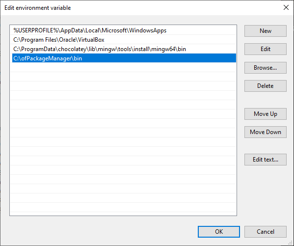

# ofPackageManager

## Description

ofPackageManager is an experimental package manager for openFrameworks. It is compatible with version 0.10.0 or higher and it does not support windows yet.
The current command line interface is very similar to npm, but I am open for suggestions.

## Build status

[](https://travis-ci.org/thomasgeissl/ofPackageManager)

## Installation

### OSX

#### brew

On OSX you can install the package manager via brew. This will download the most recent version of the package manager and add it to your path.

```
brew tap thomasgeissl/tools
brew install ofpackagemanager
# brew upgrade ofpackagemanager
```

#### manually

Or copy this line and paste it in your terminal. It will download the most recent version of the package manager and add it to your path.

```
bash -c "$(curl -sSL https://raw.githubusercontent.com/thomasgeissl/ofPackageManager/master/scripts/osx/downloadAndAddToPath.sh)"
```

### Windows

On Windows you have to install the `exe` manually.

1. Download the latest release for Windows [here](https://github.com/thomasgeissl/ofPackageManager/releases).
1. Unzip the package anywhere on your hard drive. Make sure to keep the entire contents of the folder, including the DLLs.
1. Add the package folder to the `PATH` variable. Steps on how to do this can be found [here](https://www.addictivetips.com/windows-tips/set-path-environment-variables-in-windows-10/).



### Building

- You can download a fresh version of openFrameworks, as well as ofPackageManager and its depedencies via the following commands.
  cd into your preferred installation directory, e.g. `mkdir ~/.ofPackageManager && cd ~/.ofPackageManager`

```
sh -c "$(curl -sSL https://raw.githubusercontent.com/thomasgeissl/ofPackageManager/master/scripts/install.sh)"
```

- Or you can clone it manually: `git clone https://github.com/thomasgeissl/ofPackageManager.git`. Its dependencies can be cloned via the provided `install_dependencies.sh` script or the online version of the package manager.

It is recommended to add the path your bash profile. Have a look at the `add_to_path.sh`script.

## Usage

Run the global configuration in order to install addons globally. `ofPackageManager config -g`

### Package management

- Install package by id: `ofPackageManager install ofxMidi`
- Install package by github name (user/repo): `ofPackageManager install arturoc/ofxAruco`
- Install package by url: `ofPackageManager install https://github.com/kylemcdonald/ofxCv.git`
- Installing an addon will also install its dependencies: `ofPackageManager install https://github.com/thomasgeissl/ofxPackageManageableExampleAddon.git`
- Install addons globally: `ofPackageManager install -g kylemcdonald/ofxCv`
- Install specific commit or tag by appending an @ followed by the hash or tag name: e.g. `ofPackageManager install ofxMidi@2f0e6343c817a4f5a33b60339c82b5d10be8af01`
- Add already cloned repositories: `ofPackageManager add -A local_addons`
- Install dependencies of a package: `ofPackageManager install`
- Search package in database: `ofPackageManager search ofxHTTP`
- Search package on github by name: `ofPackageManager search github ofxSyphon`
- Search package on github by user: `ofPackageManager search github --user arturoc`

### Package manager update/info

- Info: `ofPackageManager info`
- Help/man: `ofPackageManager help`
- Print version: `ofPackageManager version`
- Check for updates: `ofPackageManager doctor`
- Upate packages database: `ofPackageManager update`

## Best practices

- Do not forget to add local_addons to your .gitignore: `echo "./local_addons" >> .gitignore`
- Configure the package manager locally if you have more than one openFrameworks versions installed on your computer.
- Configure the package manager locally if you want to use your own custom packages database for a project.
- You can also use the bash-based online version if you do not have the package manager installed on your machine. e.g. `cd into/your/project/app` and execute the following to install its dependencies: `bash -c "$(curl -sSL https://raw.githubusercontent.com/thomasgeissl/ofPackageManager/master/scripts/ofPackageManager.sh)" install`

## json interface

ofPackageManager also accepts json commands, this can be useful if you wanna integrate it into another application.

Commands are valid json objects and follow the following structure:

```json
{
  "type": "TYPE",
  "payload": {
    "config": {
      "localAddonsPath": "local_addons",
      "ofPath": "/Users/thomas.geissl/libs/of_v0.11.0_osx_release/",
      "packagesPath": "/Users/thomas.geissl/.ofPackages"
    },
    "cwd": "this is optional",
    "otherProperties": "such as id, checkout, destination, ..."
  }
}
```

The following types are available: `GETVERSION, INSTALL, INSTALLPACKAGEBYID, INSTALLPACKAGEBYGITHUB, INSTALLPACKAGEBYURL`

## Known issues

- The version of the project generator bundled with 0.10.1 does not support comments in the addons.make file. It is fixed on github, the version included in the nightly builds should work.

## License

This software is distributed under the [MIT License](https://en.wikipedia.org/wiki/MIT_License).

Copyright (c) 2019 Thomas Geissl

Permission is hereby granted, free of charge, to any person obtaining a copy of this software and associated documentation files (the "Software"), to deal in the Software without restriction, including without limitation the rights to use, copy, modify, merge, publish, distribute, sublicense, and/or sell copies of the Software, and to permit persons to whom the Software is furnished to do so, subject to the following conditions:

The above copyright notice and this permission notice shall be included in all copies or substantial portions of the Software.

THE SOFTWARE IS PROVIDED "AS IS", WITHOUT WARRANTY OF ANY KIND, EXPRESS OR IMPLIED, INCLUDING BUT NOT LIMITED TO THE WARRANTIES OF MERCHANTABILITY, FITNESS FOR A PARTICULAR PURPOSE AND NONINFRINGEMENT. IN NO EVENT SHALL THE AUTHORS OR COPYRIGHT HOLDERS BE LIABLE FOR ANY CLAIM, DAMAGES OR OTHER LIABILITY, WHETHER IN AN ACTION OF CONTRACT, TORT OR OTHERWISE, ARISING FROM, OUT OF OR IN CONNECTION WITH THE SOFTWARE OR THE USE OR OTHER DEALINGS IN THE SOFTWARE.

## Changelog
